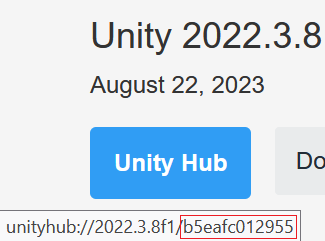

# Unity Builder

A Docker Compose application to kickstart a Unity Jenkins builder integrated with Perforce. You can have the Jenkins CI/CD server automatically make builds whenever you want.

## Getting Started
Define your environment variables in `.env`, then start the Docker application via Compose.
## Docker post setup
### Set up Unity
#### Install Unity in Docker
Figure out the version, changeset number, and modules needed for the Unity version you want to use, and use the command below to install it:
```bash
xvfb-run unityhub --headless install --version <version> --changeset <changeset> -m <modules> --childmodules
```
- To find the changeset number, you can go to the Unity download archive - the custom URI for the "Unity Hub" button will contain the changeset number.

For example, to install Unity 2022.3.8 with Windows and Mac Mono build support, you would run the following command based on the image below:

```bash
xvfb-run unityhub --headless install --version 2022.3.8f1 --changeset b5eafc012955 -m mac-mono windows-mono --childmodules
```



If you are building on platforms besides Windows and Mac, you will need to change which modules you install.

#### Activate Unity

To activate Unity without a GUI, you'll need to generate an [activation file](https://docs.unity3d.com/Manual/ManualActivationGuide.html):

```bash
cd /var/jenkins_home/Unity/Hub/Editor/<version>/Editor/
./Unity -batchmode -createManualActivationFile -logfile
```
Copy the activation file to your computer. By default, the activation file name should be `Unity_v<version>.alf` In Windows:
```shell
docker cp <container-name>:/var/jenkins_home/Unity/Hub/Editor/<version>/Editor/<alf file> $env:userprofile\Downloads\<alf file>
```
Activate the license on Unity: https://license.unity3d.com/manual
- At the time of writing, Firefox doesn't work
- Also note that if you don't have a serial number and are planning on using Unity Personal Edition, you'll need to use a workaround to get your license activated 

Copy license file back to server. By default, the activation file name should be `Unity_v<version year>.x.ulf`. In Windows:
```shell
docker cp $env:userprofile\Downloads\<ulf file> <container-name>:/var/jenkins_home/Unity/Hub/Editor/<version>/Editor/<ulf file>
```
Use the ulf to complete the activation:
```bash
./Unity -batchmode -nographics -manualLicenseFile <ulf file>
```

### Set up Jenkins
Log in to the Jenkins server at `localhost:8080` using the credentials that were set up in your environment variables.

Then, set up a job or pipeline that will run the scripts needed to build from Unity.

### Fix Wwise
You might have an issue when building games that use Wwise, like seen [here](https://gitlab.com/game-ci/unity3d-gitlab-ci-example/-/issues/53) and [here](https://forum.unity.com/threads/wwise-integration-build-failed-at-unity-cloud-only.562462/)
- TLDR, you must first ensure you have Wwise platform integration for Linux, since that's what this Docker container uses to build
- Then, fix the define directives so that Wwise scripts work on `UNITY_EDITOR_LINUX`. For me, that includes fixing the following files:
  - In `Wwise/API/Runtime/Generated/Linux`:
    - `AkAudioAPI_Linux.cs`
    - `AkCommunicationSettings_Linux.cs`
    - `AkPlatformInitSettings_Linux.cs`
    - `AkSoundEngine_Linux.cs`
    - `AkSoundEnginePINVOKE_Linux.cs`
    - `AkThreadProperties_Linux.cs`
    - `AkUnityPlatformSpecificSettings_Linux.cs`
  - In `Wwise/API/Runtime/Handwritten/Common`:
    - `AkSoundEngine.cs`
  - In `Wwise/API/Runtime/Handwritten/Linux`:
    - `AkLinuxBasePathGetter.cs`
    - `AkLinuxSettings.cs`
    - `AkSoundEngine.cs` (also fix the weird character)

## Limitations

If you're running Docker on a Windows machine, there is currently no way to integrate NVIDIA into your Docker container and utilize Unity NVIDIA features like DLSS.
Otherwise, you can install the [NVIDIA Container Toolkit](https://docs.nvidia.com/datacenter/cloud-native/container-toolkit/latest/install-guide.html) and set that up.